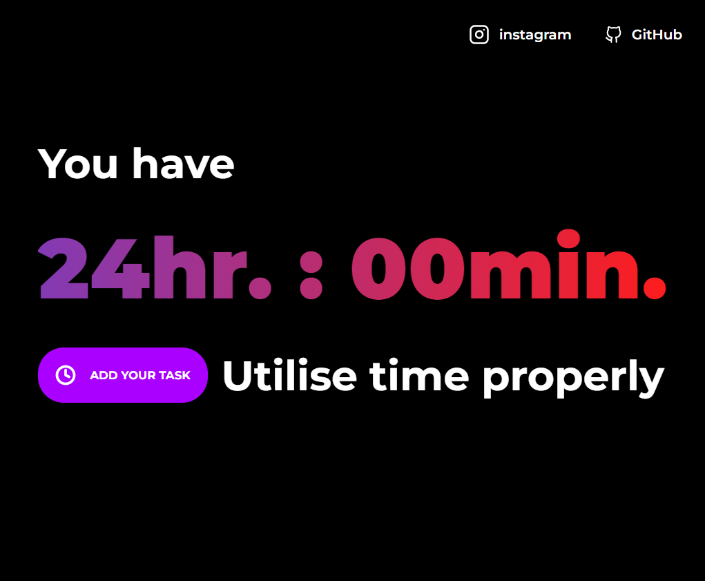
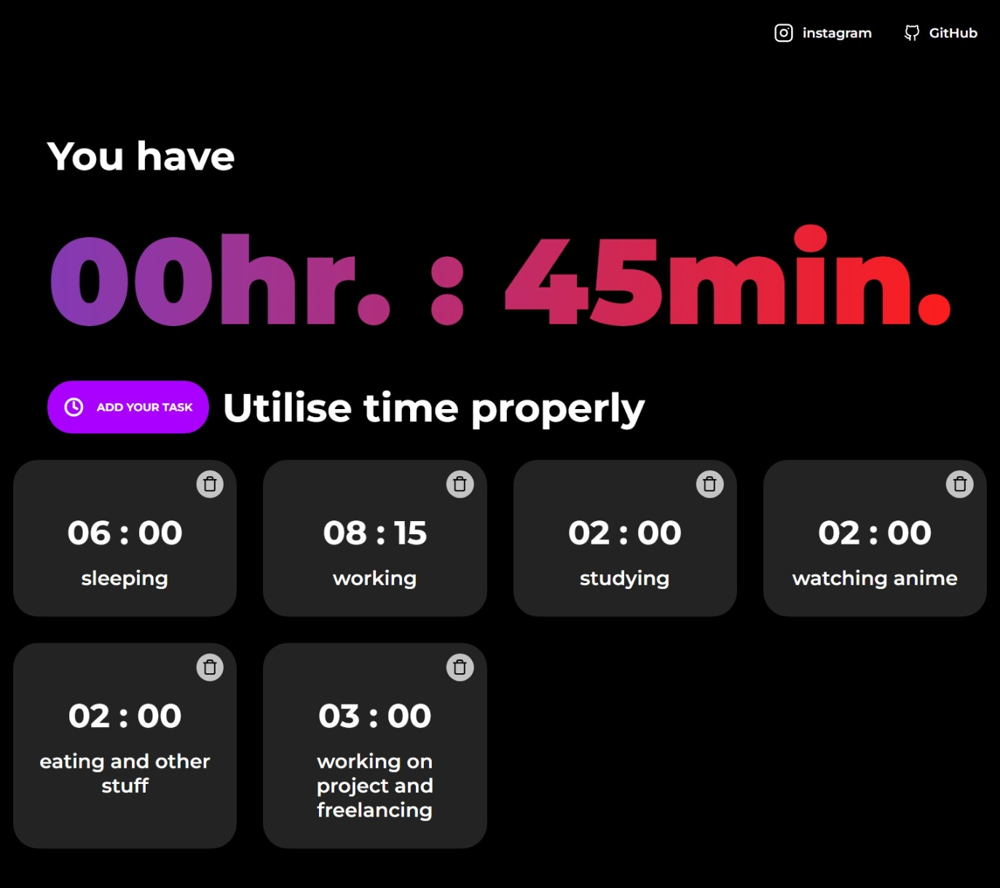

# UtiliseTime

Decide how much time to give to a task

# SCREENSHOTS

<!--  -->



<!--  -->

# DEMO

[Web App](https://utilisettime.netlify.app)

## Installation

```bash
yarn add or npm install
```

## Usage

```react
yarn start or npm start
```

## Contributing

Pull requests are welcome. For major changes, please open an issue first to discuss what you would like to change.

Please make sure to update tests as appropriate.
