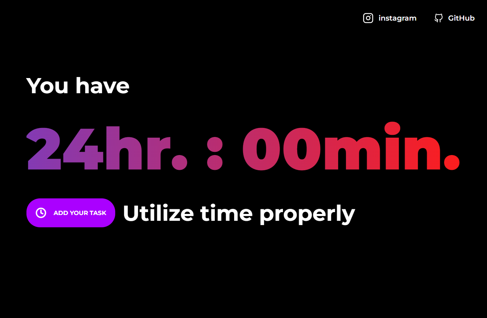

# UtiliseTime

Decide how much time to give to a task

# SCREENSHOTS




# DEMO

<<<<<<< HEAD
[Web App](https://utilisetime.netlify.app)
=======
[Web App](https://utilisetime.netlify.app/)
>>>>>>> 86bc96df2b222edf6b884fd1e20a11cb6156acbd

## Installation

```bash
yarn add or npm install
```

## Usage

```react
yarn start or npm start
```

## Contributing

Pull requests are welcome. For major changes, please open an issue first to discuss what you would like to change.

Please make sure to update tests as appropriate.
